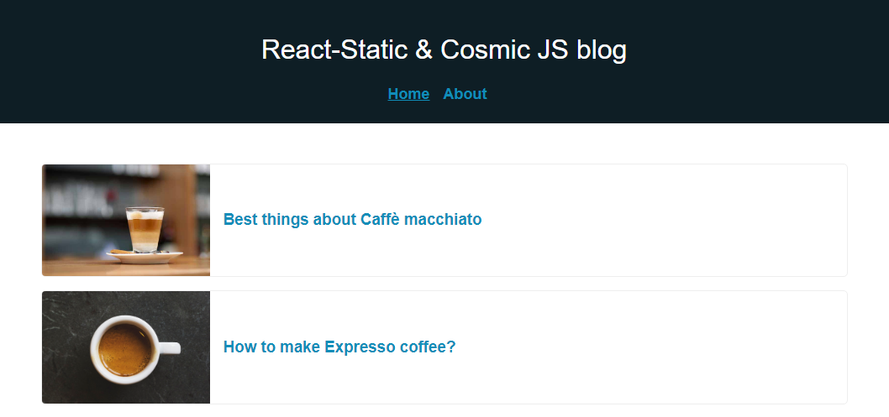

# React-Static + Cosmic JS



> This repo contains an example blog website that is built with [React-Static](https://react-static.js.org), and [Cosmic JS](https://www.cosmicjs.com).

### [View Demo](https://cosmicjs.com/apps/react-static-blog)

## Prerequisites

- Node (I recommend using v8.2.0 or higher)
- [React-Static CLI](https://react-static.js.org)

## Getting Started

``` bash
git clone https://github.com/sumitkharche/react-static-cosmicjs-blog.git
cd react-static-cosmicjs-blog
npm install or yarn install
```
### Run
``` bash
npm run start
```
Open http://localhost:3000.

### Production
``` bash
npm run build
```
